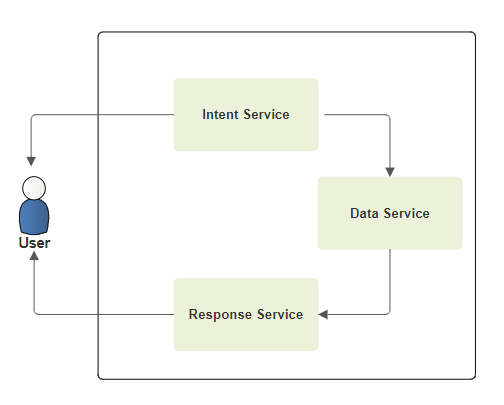

# PoC-for-LLM-based-ChatBot-regarding-EU-AI-Regulation
**Proof of Concept (PoC) for Language Model-Based Chatbot concerning EU AI Regulation**.

# Objective
Chatbots, empowered by artificial intelligence (AI), are computer programs designed to mimic human conversation. These sophisticated tools can be seamlessly integrated into websites, messaging applications, and various digital interfaces, offering benefits like cost reduction, enhanced efficiency, and heightened customer satisfaction.

ChatGPT possesses the unique capability to address queries involving data not encountered during its training, accommodating information that is either private or was unavailable prior to its 2021 knowledge cutoff.

**This Proof of Concept (PoC) aims to leverage Large Language Model (LLM) technologies within chatbots to evaluate their potential advantages: cost-effectiveness, round-the-clock availability, minimized customer waiting times, tailored corporate information, and insightful analysis of customer behavior.**

# Methodology
The data we have used related to the EU AI Laws and related regulations form various sources. We have used comprehensive PDF files outlining current AI Law.

As those PDF files are too large to send to the OpenAI models in a prompt, a solution must be used as current language models cannot consider large files with hundreds of pages. In the near future, as the size of input contexts increases, there will likely be situations for which the use of information retrieval techniques will not be technically necessary.

We use for this an information retrieval process throughout a **data service**. Our PDF files data are previously prepared with embeddings and stored in a **FAISS vectorial database**. Then, they are made available to restore from the database. In this process, the most suitable answer to the customer query to the database is recovered.

We use **generative AI model**s, in particular several ChatGPT or GPT-4 related models:
* **"gpt-3.5-turbo"**: we use it to extract keywords from the user’s question by checking whether the question from the user does not respect GPT’s policy (e.g., malicious or sensitive,  input). 
* **"text-embedding-ada-002"**: we use it to create embeddings  which are a numerical representation of text that can be used to measure the relatedness between two pieces of text. We will save them into the **FAISS vectorial database**, and later we will recover them to answer the user's question. Embeddings are useful for search, clustering, recommendations, anomaly detection, and classification tasks. You can read more about OpenAI latest embedding models in the “announcement blog post”. The “text-embedding-ada-002” is a designed to replace the previous 16 first-generation embedding models at a fraction of the cost. The reason to use it, it is better, cheaper, and simpler to use.
* **"text-davinci-003"**: we use it to answer the questions based on the text found by the FAISS vector database.

We use the **LangChain framework** which is dedicated to developing LLM-powered apps. **LangChain** is a better fit to create bespoke language model-based applications that cater to chatbots or virtual assistants. LangChain is an open-source Python framework that facilitates the development of applications powered by large language models (LLMs) such as OpenAI’s GPT-3, Google’s BERT, and Meta’s LLaMA. LangChain offers a suite of tools, components, and interfaces that simplify the construction of LLM-centric applications. With LangChain, it becomes effortless to manage interactions with language models, seamlessly link different components, and incorporate resources such as APIs and databases. 

**LangChain’s key functionalities** are divided into modules: models, prompts, indexes, chains, agents, and memory. OpenAI and many other LLM providers are in this list of integrations. Most of these integrations need their API key to make a connection. For the OpenAI models, we do this setup with the key set in an **OPENAI_API_KEY** environment variable which should be defined in the .env file.

# Implementation
Here we focus on a more software oriented than “fine-tunning”. The idea is to use ChatGPT or GPT-4 models for information restitution, but not information retrieval: we do not expect the AI model to know the answer to the question. Rather, we ask it to formulate a well-thought answer based on text extracts we think could match the question. The idea is represented in this figure:

We use the following three components:
* An **"intent service"**: when the user submits a question to your application, the intent service’s role is to detect the intent of the question. Is the question relevant to your data? Perhaps you have multiple data sources: the intent service should detect which is the correct one to use. It could detect whether the question is related to your dataset (and if not, return a generic decline message), or add mechanisms to detect malicious intent. This service could also detect whether the question from the user does not respect our corporate’s policy, or perhaps contains sensitive information. We can save this questions in a database for a further analysis. For this PoC, however, our intent service is very simple— it extracts keywords from the user’s question using the ChatGPT "gpt-3.5-turbo" model. Thus, this intent service will be based on an OpenAI model in this example. 
* An **"data service"**: this service will take the output from the intent service and retrieve the correct information. This means our data will have already been prepared with embeddings and stored in the vectorial database, and then made it available to restore from the database with this service. Thus, we compare the embeddings between our data and the user’s query. The embeddings is generated with the “text-embedding-ada-002” model from OpenAI, and they are stored then in a vector database. The data service is easy to do with LangChain and embeddings.
* A **"response service"**: this service will take the output of the data service and generate from it an answer to the user’s question. We again use the "text-davinci-003" OpenAI model to generate the answer.

The figure below shows the components of our ChatGPT-like solution powered with our own EU Law data.

# Screenshots
Three examples demonstrate our approach:

* Summarizing the EU AI Act.

* Explaining the need for AI regulation.

* Detailing AI risk categories in EU law.

Each question is matched with a comprehensive, contextually relevant answer, illustrating the effectiveness of our methodology in addressing complex AI-related inquiries.

# Conclusions
The Proof of Concept (PoC) presented demonstrates the advanced capabilities of AI-powered chatbots in the context of EU AI regulations. Here are some key conclusions:

* **Effective Integration of AI and Legal Information**: The PoC successfully integrates advanced AI models with a specialized database of EU AI laws, showcasing the potential of AI chatbots in legal and regulatory domains. This integration allows for accurate and context-specific information retrieval, which is crucial in areas with complex legal frameworks.
* **Advanced Technological Utilization**: The use of models like "gpt-3.5-turbo," "text-embedding-ada-002," and "text-davinci-003," combined with the FAISS vectorial database and the LangChain framework, illustrates a sophisticated approach to information processing and response generation. This approach enables handling large data sets and transforming them into insightful, user-specific answers.
* **Streamlining Information Access and Customer Interaction**: The PoC highlights how AI chatbots can streamline the process of accessing detailed legal information, making it more efficient and user-friendly. This is particularly beneficial for users seeking quick and accurate information about EU AI laws without navigating through extensive legal documents.
* **Enhancing Compliance and Understanding of EU AI Laws**: By providing tailored explanations and summaries of complex legal texts, the AI chatbot aids in enhancing the understanding and compliance with EU AI regulations. This is particularly valuable for businesses and individuals who need to stay informed about these laws.
* **Potential for Broader Application**: While the PoC focuses on EU AI laws, the methodology and technology used have broader applications. Similar systems could be developed for various domains where detailed and up-to-date information is crucial, such as healthcare, finance, and international law.
* **Future Expansion and Improvement**: The PoC sets a foundation for future improvements and expansions. As AI technology evolves, the capacity for processing larger datasets, understanding more complex queries, and providing even more nuanced responses will enhance the effectiveness of such systems.

In summary, this PoC not only demonstrates the feasibility of using advanced AI technology in specialized information retrieval and customer interaction scenarios but also opens avenues for future innovations in AI-powered digital assistance, particularly in complex and regulation-heavy sectors like law and compliance.

